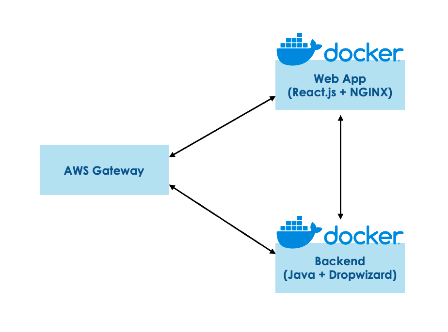
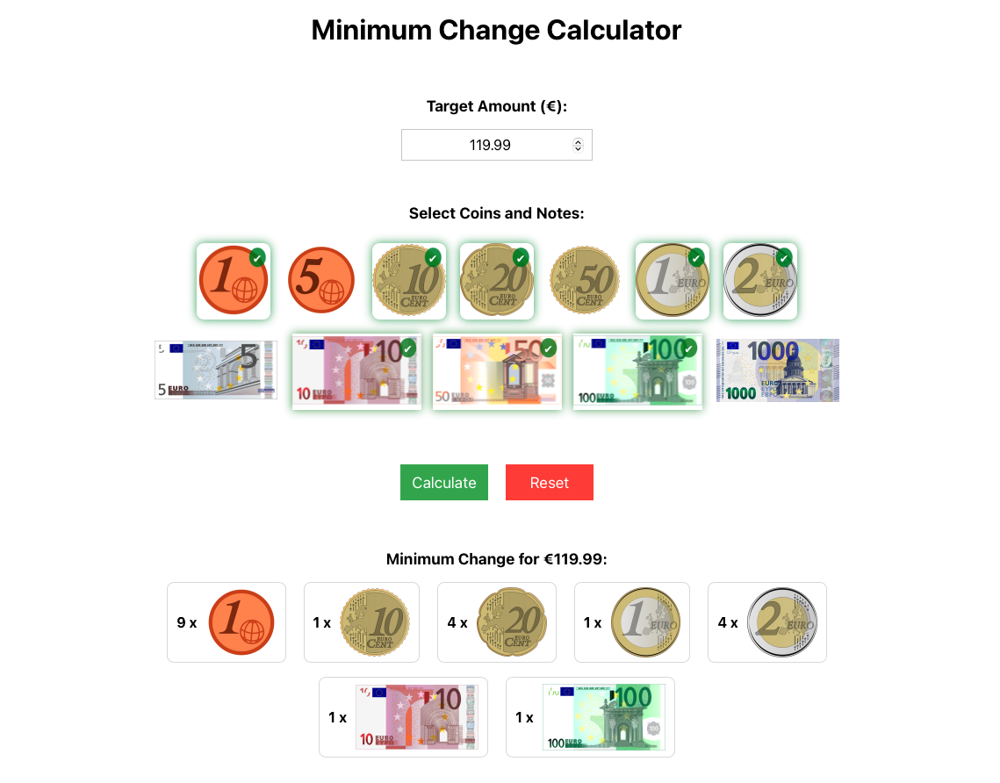

# 💵 Minimum Change Calculator

**Minimum Change Calculator** is a Dockerized microservice application that calculates the minimum number of coins or notes needed to make up a target amount using an interactive web interface and REST API. The project demonstrates containerized deployment using Docker and follows a microservice architecture.

---

## 📂 Project Overview

* **Architecture:** Dockerized microservice (separate containers for frontend and backend)
* **Frontend:** React.js with interactive icons for coin/note selection
* **Backend:** Java with Dropwizard.io REST API
* **Algorithm:** Dynamic Programming (Bottom-Up Approach) for efficient coin change calculation



---

## 💻 Live Application & API

* 🌐 Frontend: [http://54.251.131.10](http://54.251.131.10)
* 🔗 API Endpoint: [http://54.251.131.10:8080/api/coins](http://54.251.131.10:8080/api/coins)

---

## 🎨 Frontend Functionality

*Refer to the screenshot below:*

* Enter the **Target Amount** (max 10,000.00)
* Click interactive **coin/note icons** to select denominations
* Click **Calculate** to get the minimum combination
* Use **Reset** to clear the form and start over



---

## 📉 How It Works

The backend exposes a REST API that calculates the minimum number of coins needed to make up a target amount. You can assume unlimited coins for each denomination.

### ✅ Inputs:

* **Target amount:** Amount of money you need to make up (must be between `0` and `10,000.00`)
* **Coin denominations:** A list of allowed coin denominations:

```
[0.01, 0.05, 0.1, 0.2, 0.5, 1, 2, 5, 10, 50, 100, 1000]
```

### ✅ Output:

* A list of coins (in ascending order) representing the minimum number of coins needed to make up the target amount.

---

## 🛣️ Run with Docker

### Step-by-Step Setup:

1. Install Docker on your machine:
   [https://docs.docker.com/engine/install/](https://docs.docker.com/engine/install/)

2. Clone this repository:

```bash
git clone https://github.com/Ammmoe/2025_AungMyinMoe.git
```

3. Navigate into the project folder:

```bash
cd 2025_AungMyinMoe
```

4. Build and run the application with Docker:

```bash
docker compose up -d --build
```

5. Test the application:

   * Frontend: [http://localhost](http://localhost) or `http://your-cloud-instance-url`
   * Backend API: [http://localhost:8080/api/coins](http://localhost:8080/api/coins) or `http://your-cloud-instance-url:8080/api/coins`

### API Request Example (POST Method with JSON body):

```json
{
  "targetAmount": 7.03,
  "coinDenominations": [10, 0.5, 50, 0.01, 5, 100]
}
```

### API Response Example:

```json
{
  "coins": [
    0.01,
    0.01,
    0.01,
    0.5,
    0.5,
    0.5,
    0.5,
    5
  ]
}
```

---

## 📬 Contact

For any questions or suggestions, feel free to reach out!
